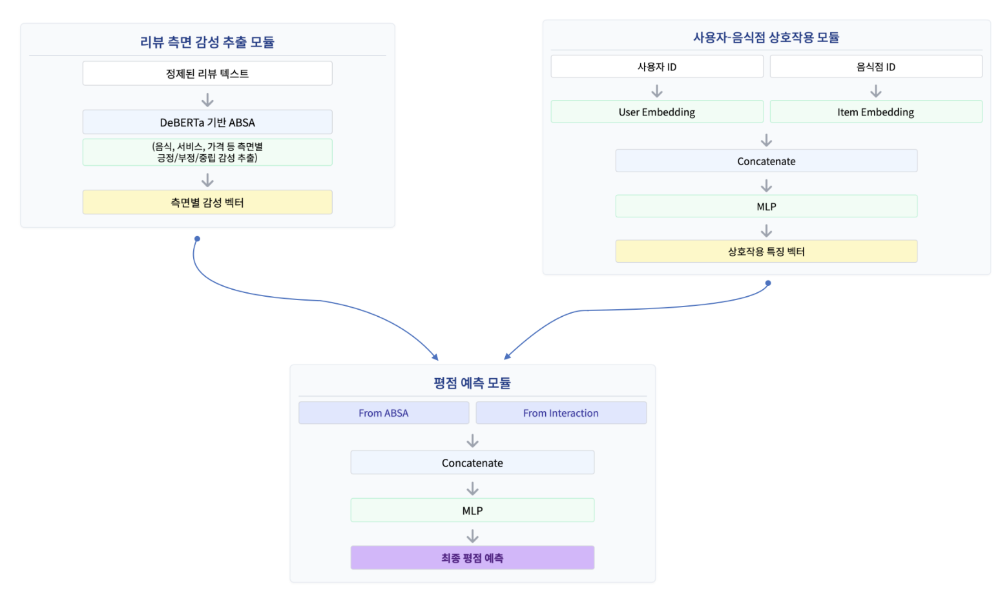
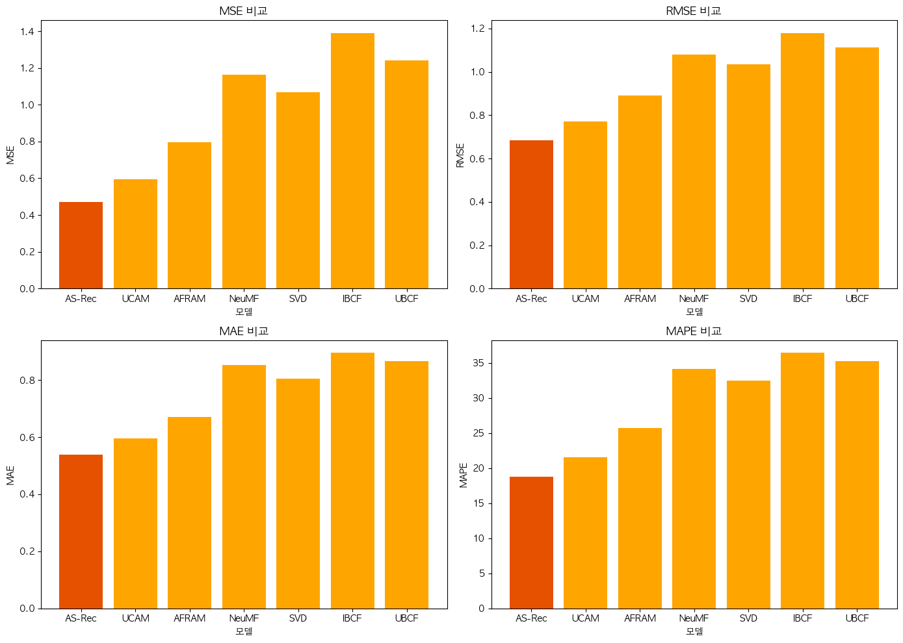

# 사용자 평점과 리뷰 텍스트를 고려한 딥러닝 기반 맛집 추천 시스템

##  개요 (Overview)

기존의 맛집 추천 시스템은 주로 사용자 평점에 의존하거나, 리뷰 텍스트의 미묘한 맥락을 이해하지  못해 평점과 리뷰 간의 의미 불일치 문제가 자주 발생합니다. 이로 인해 추천 결과에 대한 설명 가능성 부족과 사용자 신뢰도 저하라는 한계가 있습니다.

본 프로젝트는 이러한 문제를 해결하여 기존 맛집 추천 시스템의 한계를 극복하여, 사용자에게 만족도 높은 추천 경험을 제공합니다.

##  데이터(Data)

본 프로젝트에서는 Yelp Open Dataset을 기반으로 사용자 맞춤형 맛집 추천 시스템을 구축하였습니다.

## 데이터 전처리(Data Preprocessing)
- **지역 데이터 집중** : 미국 내 음식점 수가 가장 많은 주 펜실베니아(PA)의 필라델피아 시로 데이터 범위 한정
- **음식점 카테고리 필터링** : Yelp 공식 블로그의 카테고리 리스트를 참조해 음식 및 레스토랑 관련 업종만 추출 ([Yelp Category List](https://blog.yelp.com/businesses/yelp_category_list/))
- **활성 사용자 선정** : 리뷰의 신뢰도와 사용자 활동성을 고려, 필라델피아 지역 음식점에 대해 최소 5개 이상의 리뷰를 작성한 사용자 데이터만 선정

## 모델링(Modeling)

- **유저-식당 상호작용 모듈**

사용자의 선호도와 음식점의 특성을 내재된 임베딩 벡터(embedding vector) 로 학습하고, 이들을 결합하여 상호작용 표현(interaction representation)을 생성합니다.
- **리뷰 측면 감성 추출 모듈**

DeBERTa(Decoding-enhanced BERT with disentangled attention)를 활용하여
음식(Food) | 서비스(Service) | 가격(Price) | 분위기(Ambience) | 위치(Location)
5가지 측면에 대해 ABSA 수행합니다. 각 측면의 [긍정, 부정, 중립] 감성 점수를 추출합니다.

리뷰에서 추출된 감성 벡터(sentiment_vector)를 입력으로 받아, 각 리뷰가 포함한 맛, 서비스, 가격, 분위기, 위치 등의 세부 속성(aspects)에 대한 감정적 특성을 학습합니다.
- **평점 예측 모듈**

앞선 두 모듈에서 생성된 상호작용 벡터 + 감성 벡터을 하나로 결합하여, 사용자가 특정 음식점에 줄 평점을 예측합니다.

## 성능 비교 (Performance Comparison)

| Model  | MSE    | RMSE   | MAE    | MAPE    |
|--------|--------|--------|--------|---------|
| UBCF   | 1.2407 | 1.1139 | 0.8655 | 35.25%  |
| IBCF   | 1.3896 | 1.1788 | 0.8947 | 36.40%  |
| SVD    | 1.0684 | 1.0336 | 0.8039 | 32.46%  |
| NeuMF  | 1.1629 | 1.0784 | 0.8518 | 34.09%  |
| AFRAM  | 0.7952 | 0.8917 | 0.6711 | 25.72%  |
| UCAM   | 0.5937 | 0.7705 | 0.5962 | 21.58%  |
| **OURS** | **0.4697** | **0.6854** | **0.5390** | **18.79%** |

## 참고 문헌 (References)

이청용, 최사박, 신병규, 김재경. 「[온라인 호텔 리뷰와 평점 불일치 문제 해결을 위한 딥러닝 기반 개인화 추천 서비스 연구](https://www.koreascience.kr/article/JAKO202113157683309.page)」. 2021. 

우수현, 박선우, 김려, 이흠철, 이청용, 김재경. 「[고객의 속성별 중요도를 반영한 속성 기반 감성 분석(ABSA)을 이용한 레스토랑 추천 시스템](https://doi.org/10.13088/jiis.2025.31.1.045)」. 2025.

## 팀원 및 역할 (Team Members & Roles)

| 이름     | 역할                         |
|----------|------------------------------|
| 이준규   | 모델링 (Modeling)            |
| 유종범   | 모델링 (Modeling)            |
| 정민규   | 시각화 (Visualization)       |
| 강범준   | 발표, 포스터, 문서 정리 (Presentation & Docs) |
| 김성훈   | 발표, 포스터, 문서 정리 (Presentation & Docs) |
